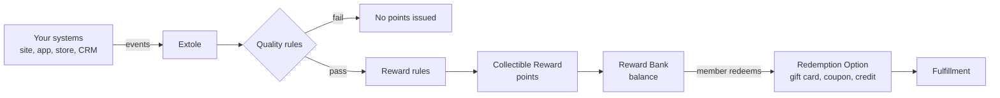

## Overview

[//]: # "How do I build a loyalty program with Extole?"

This guide covers building a loyalty program in which participants earn points for actions you
choose, accumulate them in a Reward Bank, and redeem them for rewards you configure.

Complete these five tasks:

1. **Brand your program** so links and email come from your domain.
2. **Send your earning events** from the systems where the actions happen.
3. **Configure the Reward Bank** with what points are worth and what they buy.
4. **Design the member experience** so participants can see and spend a balance.
5. **Launch and monitor** with the reports that show the program working.

<Note>
  Looking for a referral program for a membership business? That is a different build. See
  [Membership & Loyalty](/technical/solutions/extole-solution-guides/membership-loyalty).
</Note>

[//]: ___

## Brand Your Program

Loyalty programs are long-lived and email-heavy, so branding matters more here than in a
short-lived campaign. Members receive messages for years, and every one should come from you.

Set up a CNAME for your program domain and configure SPF and DKIM for branded email. These steps
are the same for every Extole program:

* [Extole DNS Requirements](/technical/operational-tasks/account-configuration/extole-dns-requirements)

## Send Your Earning Events

Each way to earn is an event. Decide the actions you will reward, then confirm each one can reach
Extole from the system that owns it.

For the catalog of actions a loyalty program commonly rewards, see
[Ways to Earn](/product/product-overview/programs/loyalty/ways-to-earn). For the integration path
for each source system — ecommerce, mobile, in-store, contact center, CRM, CDP — see
[Loyalty Data Sources](/technical/platform-integrations/loyalty-data-sources).

Two decisions to settle before you build:

**Identity.** A balance belongs to a person, so every source has to identify the participant the
same way. Send your own identifier for the participant with every event, so activity from your
site, your app, and your back-office systems lands on one profile.

**Timing.** Decide which events must arrive in real time and which can batch overnight. Real-time
events go over the API; the rest can go by file. Members notice the difference on high-visibility
actions such as a purchase.

<Warning>
  Confirm an event arrives and attributes to the right person before you attach a reward to it. An
  event that lands on a second profile produces a balance the member cannot see, and those are
  difficult to reconcile after launch.
</Warning>

## Configure the Reward Bank

Install the Reward Bank extension and configure it. The full click-path is in the
[Reward Bank Configuration Guide](/technical/platform-integrations/extensions/reward-bank/reward-bank-configuration-guide);
the decisions that shape a loyalty program are these.

### Collectible Rewards

Create one Collectible Reward per way to earn, named so the value is obvious. Choose fixed or
dynamic:

* **Fixed** — a set number of points, for actions with no monetary value such as a review or an app download.
* **Dynamic** — a percentage of the transaction, for purchases. A maximum per transaction is required; set it deliberately rather than high, because it is the cap on what a single event can cost you.

### Redemption Options

Redemption Options are what a balance buys. Configure each as a reward supplier with a dynamic
value, rather than a fixed amount, so the participant's balance determines the value.

Align the maximum with the limit your reward provider enforces.

### Redemption Rate

Set the ratio of accumulated value to dollars. The default is 1:1; a ten-point rate means one
dollar per ten points.

This number sets the cost of your program and how the offer reads to a member. Choose it before
launch and treat changes to it as a policy change. See
[Choosing Your Point-to-Reward Ratio](/guides/strategy-and-best-practices/campaign-optimization/choosing-your-point-to-reward-ratio).

### Tiers

If members earn at different rates by status, bring the tier in from your systems and write one
reward rule per tier. See
[Tiers and Member Status](/technical/platform-integrations/extensions/reward-bank/tiers-and-status).

## Design the Member Experience

Choose how members reach their balance:

| Option | Use when |
| :--- | :--- |
| Redemption Center | You have a page to embed it into, such as an account or rewards page. |
| Redemption Center Microsite | You want a standalone branded page to link to from email. |
| Your own interface | You want full control. Read the balance through the Reward Bank endpoints and render it yourself; see [Points and Balances](/technical/platform-integrations/extensions/reward-bank/points-and-balances). |

The Reward Bank requires a verified consumer. Confirm the verification path works from a logged-in
page and from an email link, where a JSON Web Token appended to the link does the authentication.
See [Verifying Consumers](/technical/operational-tasks/security-and-compliance/verifying-consumers).

Then configure the recurring messages — earned reward emails pointing at the Redemption Center, and
redemption confirmations. See
[The Member Experience](/product/product-overview/programs/loyalty/member-experience).

## Launch and Monitor

Before launch, confirm each way to earn end to end: send a real event, check the participant's
profile shows the reward, and check the balance changes in the Redemption Center.

After launch, watch points issued against points redeemed. A balance that only grows is a liability
building on your side and a member who has not found a reason to spend. See
[Reward Bank Reports](/guides/dashboards-and-reporting/report-types/rewards-reports/reward-bank-reports).

## Related

* [Loyalty](/product/product-overview/programs/loyalty/index)
* [Reward Bank](/technical/platform-integrations/extensions/reward-bank)
* [Loyalty Data Sources](/technical/platform-integrations/loyalty-data-sources)
* [How to Set Up a Loyalty Program](/guides/programs-and-campaigns/how-to-set-up-a-loyalty-program)
